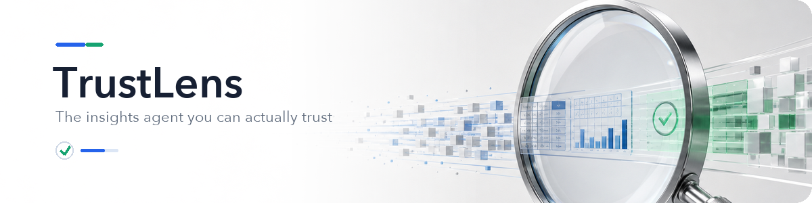

<div align="center">



<p>
  
  
  
  
  
  
  
</p>

<p><b>A multi-agent BI system that re-verifies every number before it shows it</b><br>
<sub>Capstone · 5-Day AI Agents Intensive (Google × Kaggle) · Track: Agents for Business</sub></p>

</div>

---

> **Judges — 60-second path** (no API key, no download required):
>
> ```bash
> uv sync && uv run pytest -k "not smoke" && uv run python examples/demo_verifier.py
> ```

## The problem

Enterprises are drowning in data, and "chat with your data" LLM tools promise instant answers. But they **hallucinate figures** — confidently reporting a revenue number that isn't in the data. One wrong number in a board deck is worse than no answer at all, so teams can't trust these tools for real decisions. That trust gap is the actual blocker to AI adoption in business analytics.

## The solution

TrustLens is a four-agent pipeline where an independent **Verifier** re-checks every figure against the source data before it reaches the report. Its verification is **deterministic** — it re-executes the query and compares the result to the claimed value — so a hallucination is caught with a number, not a second opinion.

```
   Business question (natural language)
            │
   ┌────────▼────────┐
   │     Planner     │  decomposes the question into steps        → state["plan"]
   └────────┬────────┘
   ┌────────▼────────┐
   │     Analyst     │  queries data via MCP tools,               → state["findings"]
   │                 │  returns figures + the SQL behind them
   └────────┬────────┘
   ┌────────▼────────┐
   │     Verifier    │  re-executes each figure's SQL, compares   → state["verification"]
   │   (the core)    │  to the claim, flags any mismatch
   └────────┬────────┘
   ┌────────▼────────┐
   │     Reporter    │  writes the report using verified-only     → state["report"]
   └────────┬────────┘
            │
   Verified insight  +  audit trail
```

Every data access passes a **security gate** (read-only, no PII, single statement) and is recorded in an **audit log**.

## How verification works — the differentiator

Most "self-checking" agents just ask the LLM again, which can hallucinate again. TrustLens re-runs the actual query and compares:

```text
Top category by revenue: beleza_saude  (true revenue: 1,258,681.34)

[honest claim]        analyst says 1,258,681.34  ->  verified = True
[hallucinated claim]  analyst says 1,485,243.98  ->  verified = False   (actual 1,258,681.34)
```

On an eval set of **24 diverse business questions** validated against real Olist data, the verifier catches **100% of injected hallucinations with 0% false rejects** — no API key needed:

```bash
uv run python eval/run_eval.py        # confirmed 24/24 · caught 24/24
uv run python examples/demo_verifier.py
```

## Course concepts

Four of the required ≥3 concepts, each load-bearing rather than decorative.

| Concept | Where |
| --- | --- |
| Multi-agent (ADK) | `SequentialAgent` orchestrating Planner / Analyst / Verifier / Reporter — `src/trustlens/pipeline.py` |
| MCP servers | a FastMCP server exposing `get_schema` and `query_data`, consumed by the Analyst via `McpToolset` over stdio — `src/trustlens/mcp_server.py` |
| Agent skills / tools | the Verifier's `verify_claim` tool; analytical querying as agent tools |
| Security | `security.py` (SELECT-only + PII gate), verification-as-trust-gate, `audit.py` trail, secrets via `.env` |

## Quickstart

Requires [uv](https://docs.astral.sh/uv/), Python 3.12, and a Gemini API key.

```bash
uv sync                                                                   # 1. dependencies

kaggle datasets download -d olistbr/brazilian-ecommerce -p data/raw --unzip
uv run python data/load_olist.py                                          # 2. build data/trustlens.db

cp .env.example .env                                                      # 3. add GEMINI_API_KEY
```

Run it:

```bash
uv run python src/trustlens/run_analyst.py "Which order status is most common?"
uv run python src/trustlens/pipeline.py "What are the top 3 product categories by revenue?"
uv run python examples/demo_verifier.py                                   # no key needed
```

> **Gemini free tier note.** All agents use `gemini-flash-latest`; the API's own rate-limit response reports it as `gemini-3.5-flash`, limited to 5 requests/min and 20/day on the free tier. A full 4-agent run uses ~8–15 calls, so use a paid tier (or Kaggle/Vertex) for repeated runs.

## Project structure

```
src/trustlens/
  db.py            read-only SQLite access (?mode=ro)
  security.py      query gate: SELECT-only, single-statement, PII block
  mcp_server.py    FastMCP data server (get_schema, query_data) + audit
  verification.py  deterministic numeric verifier (the differentiator)
  audit.py         append-only action audit log
  eval.py          verifier eval (build set + measure catch rate)
  agents/          planner · analyst · verifier · reporter
  pipeline.py      SequentialAgent wiring + run_pipeline()
  run_analyst.py   single-agent entrypoint
data/load_olist.py build the SQLite db from Olist CSVs
eval/              questions + run_eval.py
examples/          demo_verifier.py
tests/             26 unit + construct tests
```

## Testing

```bash
uv run pytest -k "not smoke"   # 32 tests, no API key needed
uv run pytest                  # adds the live smoke test (needs GEMINI_API_KEY + quota)
uv run ruff check src tests    # lint
```

## Security

- `security.py` is a defense-in-depth heuristic gate, backed by a read-only (`mode=ro`) connection: it blocks non-SELECT, multi-statement, mutating-keyword, and PII-column queries before execution — and even if one slipped past, the read-only connection prevents any write. CTEs (`WITH … SELECT`) are allowed; matching is word-boundary based to avoid false positives on aliases. Adversarial cases live in `tests/test_security.py`.
- No API keys in code — `GEMINI_API_KEY` loads from `.env` (git-ignored).
- Every data action is recorded in the audit log for traceability.
